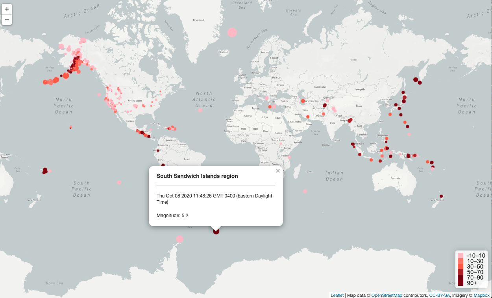
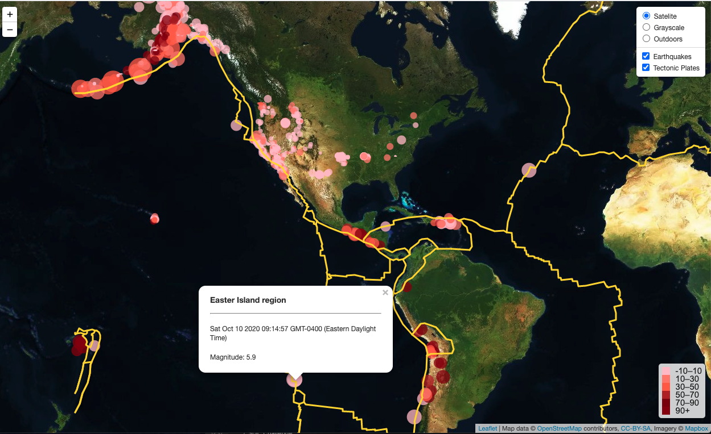
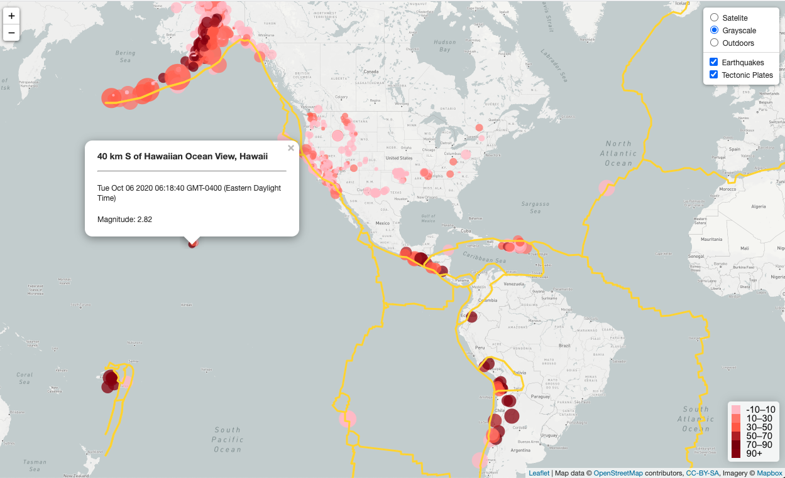
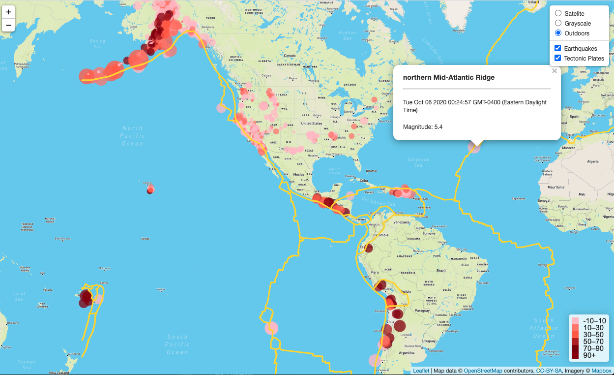

# Leaflet-Earthquake-Project
The USGS collects a massive amount of earhquake data from all over the world each day. I built a new set of tools to visualize their earthquake data.

First, I used the dataset from the url: "https://earthquake.usgs.gov/earthquakes/feed/v1.0/summary/all_week.geojson" that gives us the past 7 days' earthquake data with geoJson format.

And then, I created a map using Leaflet that plots all of the earthquakes from the data set based on their longitude and latitude.

   * My data-markers reflect the magnitude of the earthquake by their size and and depth of the earthquake by color. Earthquakes with higher magnitudes appear larger circles and earthquakes with greater depth appear darker in color.

   * I used the depth of the earth data in km using the third coordinate value for each earthquake.

   * I included popups that provide additional information about the earthquake when a marker is clicked.

   * I created a legend that provides the depth of earth in km.
   
   * This map shows the light map and earthquake data.
   
   
   
  
   * I also made the website with satelite, grayscale, and outdoors maps, earthquake data and tectonic plates data.
   
   * Satelite map:
   
   
   
   * Grayscale map:
   
   
   
   * Outdoors map:
   
   
 
 Enjoy!
   
   
   
   
